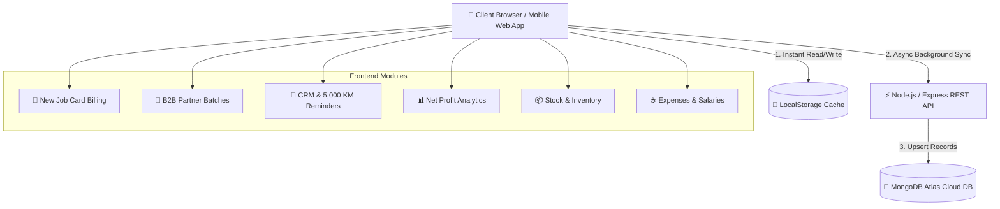

# < STOP & GO > TOTAL TYRE CARE CENTRE

<p align="center">
  
</p>

<p align="center">
  <strong>Enterprise-Grade Automotive Garage Management & B2B Contract System</strong>
  <br />
  Solapur, Maharashtra, India 🇮🇳
</p>

<p align="center">
  <a href="#-tech-stack--badges"></a>
  <a href="#-tech-stack--badges"></a>
  <a href="#-tech-stack--badges"></a>
  <a href="#-tech-stack--badges"></a>
  <a href="#-tech-stack--badges"></a>
  <a href="#-tech-stack--badges"></a>
</p>

---

## 🌟 Executive System Overview

**STOP & GO — Total Tyre Care Centre** is a state-of-the-art, 4K luxury dark-themed automotive ERP and point-of-sale platform built specifically for high-volume tyre service stations and multi-vehicle B2B contract garages.

Designed with an **Offline-First LocalStorage architecture** coupled with **Background Cloud Synchronization**, the app operates at 60 FPS without losing data even during power cuts or internet outages.

---

## 📐 System Architecture Diagram



---

## 🚀 Key Modules & Capabilities

| Module | Icon | Description | Core Capabilities |
| :--- | :---: | :--- | :--- |
| **New Job Card** | 📄 | Walk-In Retail Customer Billing | • 12 Master Services + Custom Rates<br />• Sleek Inline Price Editing Badges<br />• 80mm Thermal & A4 Print Receipts<br />• 1-Click WhatsApp Slip Sender |
| **Partner Batches** | 🏢 | B2B Bulk Contract Management | • 15–20 Day Vehicle Contract Tracker<br />• Multi-Day Service Logs per Vehicle<br />• Advance / Mid / Final Installment Ledger<br />• 3-in-1 B2B WhatsApp Statement Slips |
| **Customers & CRM** | 👥 | Customer History & Auto-Alerts | • Full Visit History per Phone Number<br />• 5,000 KM Wheel Alignment Reminders<br />• 30 km/day Automatic Service Due Alerts |
| **Financial Analytics** | 📊 | Business Profit & Loss Reports | • Gross Income vs. Daily Expenses<br />• Net Garage Profit Calculation<br />• Dedicated **UPI vs Cash** Revenue Breakdown |
| **Stock & Inventory** | 📦 | Consumables & Low-Stock Alerts | • Wheel Weights (Sticker / Brass), Valves<br />• Reorder Trigger Level Alerts<br />• ➕ Add Custom Items & 🗑️ Delete Controls |
| **Expenses & Salaries** | ☕ | Daily Shop Outflow Manager | • Daily Tea, Snacks, Spares & Supplies<br />• Staff Salary Advances & Payouts<br />• Scrap Rubber & Scrap Tyre Resale Logs |

---

## 🏢 B2B Partner Batches Contract Workflow

For bulk vehicle drop-offs (e.g. *"Sahara Motors"* dropping 10-15 vehicles for 15-20 days):

```
┌─────────────────────────────────────────────────────────────────────────┐
│ 1. CREATE BATCH CONTRACT (#SGB-2026-1042)                               │
│    Select Source Garage ➔ Set Drop-off Date & 15-20 Day Expected Pickup │
└────────────────────────────────────┬────────────────────────────────────┘
                                     │
┌────────────────────────────────────▼────────────────────────────────────┐
│ 2. RECORD ADVANCE PAYMENT (INSTALLMENT 1)                              │
│    Log Advance Payment (e.g., ₹10,000 via UPI) ➔ Send WhatsApp Slip     │
└────────────────────────────────────┬────────────────────────────────────┘
                                     │
┌────────────────────────────────────▼────────────────────────────────────┐
│ 3. MULTI-DAY VEHICLE SERVICE LOGGING                                    │
│    Add Vehicles ➔ Log Services per Vehicle over 15–20 Days Work Window  │
└────────────────────────────────────┬────────────────────────────────────┘
                                     │
┌────────────────────────────────────▼────────────────────────────────────┐
│ 4. FINAL SETTLEMENT & DELIVERY (INSTALLMENT 2)                          │
│    Log Final Payment (e.g., ₹30,000 via Cash) ➔ Balance Due = ₹0 (FULL) │
│    Generate Consolidated Batch Statement (80mm Thermal + WhatsApp)     │
└─────────────────────────────────────────────────────────────────────────┘
```

---

## 🛠️ Tech Stack & Badges

* **Frontend Engine**: React 19, Vite 8, Lucide Icons, Modern CSS Grid / Flexbox
* **Backend API**: Node.js, Express.js, Mongoose, CORS
* **Database**: MongoDB Atlas (Clean slate schema with retry handling)
* **Printing Engine**: Native Browser HTML5 `@media print` tuned for 80mm POS Thermal Receipt Printers
* **Messaging**: Direct Deep-Link WhatsApp API (`wa.me/91...`)
* **Production Hosting**:
  * **Frontend**: Vercel (`stop-and-go-tyre-care.vercel.app`)
  * **Backend**: Render Node.js Server (`GET /health` UptimeRobot monitored)

---

## 📂 Repository Directory Tree

```
stop-and-go-tyre-care/
├── backend/                  ← Express + Mongoose API Server
│   ├── server.js             ← Express REST API & MongoDB Atlas Sync
│   └── package.json
├── frontend/                 ← React 19 + Vite Web Application
│   ├── src/
│   │   ├── components/       ← UI Components & Modules
│   │   │   ├── Header.jsx           ← 8-Tab Responsive Nav Bar
│   │   │   ├── IntakeForm.jsx       ← Customer & Vehicle Form (Auto-Fetch)
│   │   │   ├── ServiceChecklist.jsx ← 12 Master Services & Price Badges
│   │   │   ├── ReceiptModal.jsx     ← 80mm POS Thermal Print Modal
│   │   │   ├── PartnerBatches.jsx   ← B2B Bulk Contract Manager [NEW]
│   │   │   ├── CustomerHistory.jsx  ← CRM & 5,000 KM Auto-Reminders
│   │   │   ├── Analytics.jsx        ← Profit Reports & UPI vs Cash
│   │   │   ├── Inventory.jsx        ← Consumables & Reorder Alerts
│   │   │   ├── Bookings.jsx         ← Service Appointments
│   │   │   ├── ExpensesAndScrap.jsx ← Shop Expenses & Scrap Sales
│   │   │   └── ServicePriceEditor.jsx ← Master Prices & Admin Security
│   │   ├── utils/
│   │   │   ├── storage.js           ← Offline-First LocalStorage Manager
│   │   │   ├── syncService.js       ← Background Cloud Synchronization
│   │   │   └── i18n.js              ← Multilingual Engine (EN, MR, HI)
│   │   ├── App.jsx                  ← Main Application Router
│   │   └── index.css                ← 4K Dark Theme Design System
│   └── package.json
├── vercel.json               ← Vercel Production Build Routing
└── package.json              ← Root Workspace Build Runner
```

---

## ⚡ Quick Start & Setup Guide

### 1. Local Development

Clone the repository and install dependencies:

```bash
git clone https://github.com/mujtabashaikh2812-stack/stop-and-go-tyre-care.git
cd stop-and-go-tyre-care
```

#### Run Frontend Web App:
```bash
cd frontend
npm install
npm run dev
# App available at http://localhost:5173
```

#### Run Backend REST Server:
```bash
cd backend
npm install
npm run dev
# API Server running at http://localhost:5000
```

---

## 📍 Garage Branch Details

* **Name**: `< STOP & GO > TOTAL TYRE CARE CENTRE`
* **Address**: `Beside Solapur Steel, Near Multani bakery, Hotgi road, Solapur.`


---

<p align="center">
  Developed with ❤️ by Advanced Agentic AI for <strong>STOP & GO Total Tyre Care Centre</strong>
</p>
