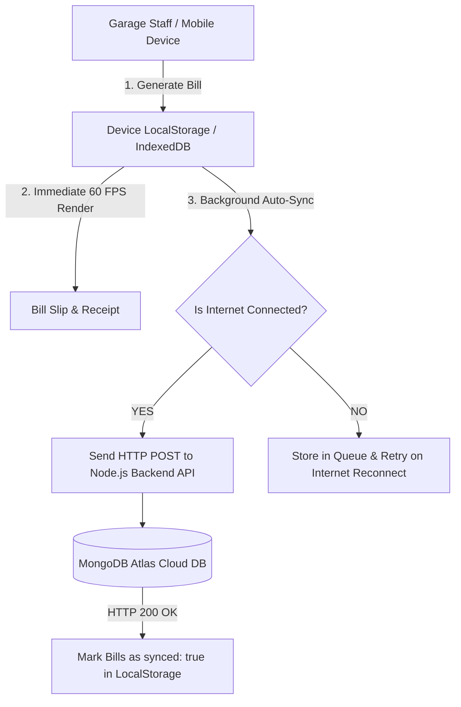

# 🚀 STOP & GO Garage App - Offline-First MongoDB Cloud Sync & APK Guide

This technical guide details how to implement **Offline-First Synchronization with MongoDB Cloud** and package the application into a native **Android APK**.

---

## 🏗️ 1. Architecture Overview

In an **Offline-First** design, local shop operations never depend on cloud network latency or active internet connections.



---

## 🛠️ 2. Frontend Implementation

### Step 1: Update Job Card Storage (`src/utils/storage.js`)

Add a `synced: false` flag to every newly generated job card:

```javascript
export const saveJobCard = (newCard) => {
  const current = getJobCards();
  // Mark new bill as unsynced
  const cardWithSyncFlag = { ...newCard, synced: false };
  const updated = [cardWithSyncFlag, ...current];
  
  localStorage.setItem('stop_go_job_cards_v3', JSON.stringify(updated));
  
  // Trigger background cloud sync if online
  triggerCloudSync();
  return updated;
};
```

---

### Step 2: Create Background Sync Service (`src/utils/syncService.js`)

Create a dedicated background sync module to handle network checks and API payloads:

```javascript
import { getJobCards } from './storage';

export const triggerCloudSync = async () => {
  // 1. Verify network connectivity
  if (!navigator.onLine) {
    console.log('⚡ Device is offline. Local data preserved safely.');
    return;
  }

  const allCards = getJobCards();
  // 2. Filter unsynced records
  const unsyncedCards = allCards.filter(card => !card.synced);

  if (unsyncedCards.length === 0) {
    console.log('✅ All local records are synced with MongoDB Cloud.');
    return;
  }

  try {
    // 3. Post unsynced records to your backend API
    const response = await fetch('https://your-api.com/api/sync-jobcards', {
      method: 'POST',
      headers: { 'Content-Type': 'application/json' },
      body: JSON.stringify({ jobCards: unsyncedCards })
    });

    if (response.ok) {
      const syncedIds = unsyncedCards.map(c => c.id);
      // 4. Update local state to synced: true
      const updatedCards = allCards.map(c =>
        syncedIds.includes(c.id) ? { ...c, synced: true } : c
      );
      localStorage.setItem('stop_go_job_cards_v3', JSON.stringify(updatedCards));
      console.log(`🎉 Successfully synced ${unsyncedCards.length} bill(s) to MongoDB Cloud!`);
    }
  } catch (error) {
    console.error('⚠️ Cloud sync failed. Will retry on next network reconnect.', error);
  }
};
```

---

### Step 3: Listen for Network Reconnection (`src/App.jsx`)

In `App.jsx`, attach an event listener for `window.onLine`:

```javascript
import { useEffect } from 'react';
import { triggerCloudSync } from './utils/syncService';

export default function App() {
  useEffect(() => {
    // Sync immediately on app startup
    triggerCloudSync();

    // Auto-sync whenever internet reconnects
    const handleOnline = () => {
      console.log('🌐 Network connected! Initiating MongoDB sync...');
      triggerCloudSync();
    };

    window.addEventListener('online', handleOnline);
    return () => window.removeEventListener('online', handleOnline);
  }, []);

  // ... rest of App component
}
```

---

## 🌐 3. Node.js + Express + MongoDB Backend API

Create a minimal backend server using Express and Mongoose:

```javascript
// server.js (Node.js Express + Mongoose)
const express = require('express');
const mongoose = require('mongoose');
const cors = require('cors');

const app = express();
app.use(cors());
app.use(express.json());

// Connect to MongoDB Atlas
mongoose.connect('mongodb+srv://<username>:<password>@cluster0.mongodb.net/stop_and_go_db');

// Schema Definition
const JobCardSchema = new mongoose.Schema({
  id: String,
  date: String,
  time: String,
  customerName: String,
  mobile: String,
  vehicleName: String,
  vehicleNumber: String,
  year: String,
  odometer: String,
  services: Array,
  subtotal: Number,
  discount: Number,
  total: Number,
  paymentMethod: String,
  status: String
}, { timestamps: true });

const JobCardModel = mongoose.model('JobCard', JobCardSchema);

// Sync Endpoint
app.post('/api/sync-jobcards', async (req, res) => {
  try {
    const { jobCards } = req.body;
    for (const card of jobCards) {
      await JobCardModel.updateOne(
        { id: card.id },
        { $set: card },
        { upsert: true }
      );
    }
    res.status(200).json({ success: true, count: jobCards.length });
  } catch (err) {
    res.status(500).json({ error: err.message });
  }
});

app.listen(5000, () => console.log('🚀 Backend running on port 5000'));
```

---

## 📱 4. Android APK Packaging (Capacitor Workflow)

To convert the web build into a native `.apk` installer file for your client:

```bash
# 1. Build optimized web assets
npm run build

# 2. Install Capacitor dependencies
npm install @capacitor/core @capacitor/cli @capacitor/android

# 3. Initialize Capacitor
npx cap init "STOP & GO Tyre Care" "com.stopandgo.tyrecare" --web-dir dist

# 4. Add Android Platform
npx cap add android

# 5. Open in Android Studio
npx cap open android
```

In Android Studio:
1. Select **Build > Build Bundle(s) / APK(s) > Build APK(s)**.
2. Share the generated **`app-release.apk`** with your client via WhatsApp or Google Drive!
